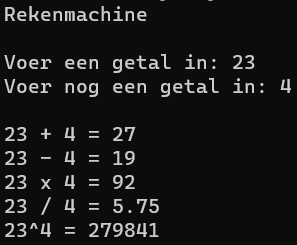

# Opdrachten Powershell

## Opdracht 5 - Math

## Opdracht 6 - DeleteOldFiles

## Opdracht 7 - DeleteEmptyFolders

## Opdracht 8 - Age

## Opdracht 9 - Logon / Logoff

## Opdracht 10 - Help_File

## Opdracht 11 - Permissions

## Opdracht 12 - ADUsers + gebruikers verwijderen uit OU

